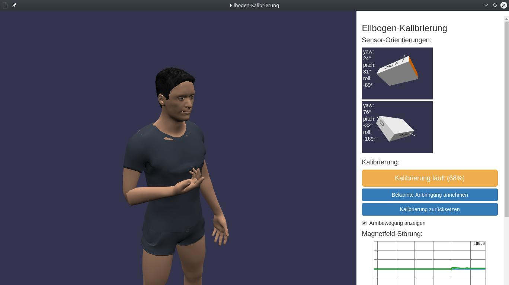

# Babylon Webapps

## How to run the demos/examples

Many demos require a Simulink and/or Python backend to run which can also be found in the same folder.

In Firefox, the `index.html` file can usually just be opened directly. With Chrome/Chromium, accessing some files (e.g. textures) is only possible when a local webserver is started. It is recommended to use the provided `webapp.sh` script, which runs a server and then opens the website in Chromium's app mode (i.e. without location bar):

~~~sh
cd demos/$example
../../webapp.sh
~~~

## Creating a symlink to the `lib/` folder

~~~sh
ln -s ../../lib lib
~~~

## Coding Style

- use 4 spaces, no tabs
- use single quotes for strings in JavaScript
- try to follow the style of the existing code whenever possible

## Overview of all existing demos/examples

### demos/back-posture

- requires Simulink backend and 3 Xsens IMUs

### demos/euler-angles

- no backend required
- available online at <http://www.user.tu-berlin.de/laidig/eulerdemo/>

### demos/imu-rawdata-magdist

- requires both Simulink backend (1 Xsens IMU) and Python backend

### demos/oriestimu

- requires Simulink backend (1 Xsens IMU)

### demos/root-locus

- requires Simulink backend (no hardware)

### demos/smartphone-imu

- only runs on smartphones
- not all devices and browsers supported
- available online at <http://www.user.tu-berlin.de/laidig/imu/>

### examples/elbow-calibration

- example code based on a demo shown at Zukunftskongress 2017, not fully functional
- backend is not included, instead a script `replay.py` can be used to replay a recorded data set
